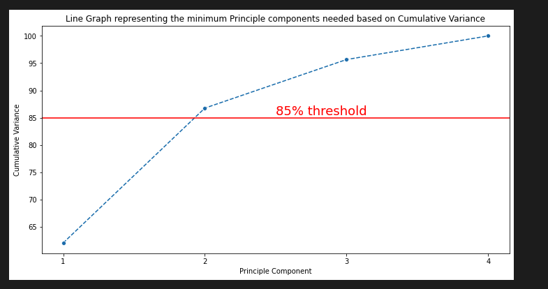

# Unsupervised Learning US Arrest

## Table of Contents  
[Project Details](<./readme.md#Project Details>)

[Installation and Usage](<#Installation and Usage>)

[Screen shots](<#Screen shots>)

[Credits](<./readme.md#Credits>)

## Project Details
- US Arrest
- explore the differences between using
unsupervised learning methods such as Principal Component Analysis (PCA) and
various clustering techniques. Working with UsArrest dataset

## Installation and Usage

- open UsArrests_capstone_project_unsupervised_learning.ipynb and run using Jupyter/Python runtime
 
## Screen shots

## Credits

project made by Ashley Cuzzocrea 